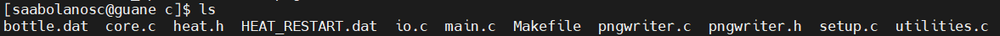

# Procesamiento-Memoria-Distribuida

**Arquitectura de la máquina:**

- Procesador: 11th Gen Intel(R) Core(TM) i5-11300H @ 3.10GHz   3.11 GHz
- 16GB RAM
- Tarjeta gráfica: 3050 Nvidia

Para comenzar a hacer nuestro análisis y ver la diferencia entre los distintos métodos de optimización, lo primero que haremos será partir con unos valores de ejecución base, los cuáles se obtuvieron por medio del código suministrado para el ejercicio sin aplicar modificaciones previas.

- **Archvios previos a hacer "make"**


- **Archivos luego de hacer "make"**


- **Se ejecuta mpirun -np 4 heat_mpi**


- **Se ejecuta mpirun -np 4 heat_mpi bottle.dat**


- **Se ejecuta mpirun -np 4 heat_mpi bottle.dat 1000 (pasos de tiempo)**


- **Se ejecuta mpirun -np 4 heat_mpi 800 800 1000 (dimensiones y pasos de tiempo)**


# Análisis de los archivos más importantes
La solución propuesta en el curso nos presenta un documento de datos el cual usa el algoritmo para ejecutar las etapas de la transferencia de calor, el código setup.c existe una funcion llamada inicializate en donde parte de las tareas de esta, es verificar si hay un checkponit de los datos sobre los cuales se ha ejecutado el algoritmo y continua a partir de estos, por esto cada que se ejecuta el  heat_mpi se generan imágenes nuevas con un notorio cambio de temperatura en el mapa de calor. El algoritmo de core. C es una extensión de setup pero este se centra en las estructuras principales para resolver la ecuación de calor.

# Cambios realizados al main.c y su estructura
Se identifica que el archivo que más influye en los tiempos de ejecución, es main.c, es por esto que se deciden hacer ciertas modificaciones de las cuáles se irá viendo su estructura y su respectiva explicación de cada parte:

1. Inclusión de Bibliotecas:
````
#include <stdio.h>
#include <stdlib.h>
#include <mpi.h>
#include "heat.h"
````
Se incluyen las bibliotecas estándar de entrada/salida, manejo de memoria dinámica, MPI para programación paralela, y un archivo de encabezado personalizado ("heat.h").

2. Declaración de Variables:
````
double a = 0.5;             // Constante de difusión
field current, previous;    // Campos de temperatura actual y anterior
double dt;                  // Paso de tiempo
int nsteps;                 // Número de pasos de tiempo
int image_interval = 500;   // Intervalo de salida de imágenes
int restart_interval = 200; // Intervalo de salida de checkpoints
parallel_data parallelization; // Información de paralelización
int iter, iter0;            // Contadores de iteración
double dx2, dy2;            // Deltas al cuadrado en x e y
double start_clock;         // Marca de tiempo inicial
````
Se declaran variables para almacenar parámetros del problema, información sobre la malla y el tiempo, así como estructuras de datos para almacenar los campos de temperatura actual y anterior. También se declaran variables relacionadas con la paralelización y contadores de iteración.

3. Inicialización MPI y del Problema:
````
MPI_Init(&argc, &argv);
initialize(argc, argv, &current, &previous, &nsteps, &parallelization, &iter0);
````
Se inicializa MPI y se lleva a cabo la inicialización del problema, configurando la distribución de trabajo entre los procesos MPI y estableciendo las condiciones iniciales.

4. Cálculos Preliminares:
````
int rank = parallelization.rank;
int size = parallelization.size;
int local_nsteps = nsteps / size;
int extra_nsteps = nsteps % size;
````
Se realizan cálculos previos relacionados con la distribución del trabajo entre los procesos MPI.

5. Salida Inicial de Campo de Temperatura:
````
write_field(&current, iter0, &parallelization);
iter0++;
````
Se genera la salida inicial del campo de temperatura.

6. Cálculos para el Paso de Tiempo:
````
dx2 = current.dx * current.dx;
dy2 = current.dy * current.dy;
double inv_denom = 1.0 / (2.0 * a * (dx2 + dy2));
dt = dx2 * dy2 * inv_denom;
````
Se calculan los valores necesarios para el paso de tiempo, considerando la estabilidad numérica de la solución.

7. Evolución Temporal:
````
for (iter = iter0; iter < iter0 + local_nsteps + (rank < extra_nsteps ? 1 : 0); iter++) {
    // ... (evolución temporal y otros cálculos)
}
````
Se realiza la evolución temporal del sistema, distribuyendo el trabajo entre los procesos MPI. Se intercambian datos entre procesos para garantizar la coherencia en los bordes de las regiones locales.

8. Salida de Resultados y Checkpoints:
````
if (iter % image_interval == 0) {
    write_field(&current, iter, &parallelization);
}
if (iter % restart_interval == 0) {
    write_restart(&current, &parallelization, iter);
}
````
Se generan salidas visuales en intervalos regulares y se guardan checkpoints para permitir la reanudación de la simulación.

9. Estadísticas y Finalización:
````
if (rank == 0) {
    printf("Iteration took %.3f seconds.\n", (MPI_Wtime() - start_clock));
    printf("Reference value at 5,5: %f\n", previous.data[idx(5, 5, current.ny + 2)]);
}
write_field(&current, iter, &parallelization);
finalize(&current, &previous, &parallelization);
MPI_Finalize();
````
Se imprimen estadísticas, como el tiempo total de ejecución, y se finaliza la ejecución, liberando recursos y cerrando MPI.

# Resultados obtenidos usando -O1, -O2, -03, -Ofast

Luego de modificar el Makeme y probar los distintos métodos de optimización, podemos llegar a ver como cada uno de estos obtiene métricas diferentes para cada uno:

- **Para el caso de O1**

- **Para el caso de O2**

- **Para el caso de O3**

- **Para el caso de Ofast**

